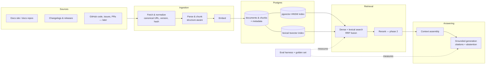

# langstack-knowledge-engine
RAG knowledge engine for LangChain and LangGraph, ingesting docs, repositories, issues, and other sources into a searchable vector-backed knowledge base for grounded agent context, retrieval, and experimentation.

## Plan (living doc — will change a lot)

**Approach:** Postgres + pgvector as the single store (vectors, lexical/tsvector index, metadata, job state). Hybrid retrieval (dense + lexical, fused) from day one, not dense-only — the corpus is API docs full of exact identifiers that lexical search catches and embeddings miss. Structure-aware chunking that never splits a code fence from its lead-in prose. An eval harness (golden question set + metrics) built alongside the pipeline, not after it, so every design decision is measured rather than assumed.

**Phased roadmap:**
| Phase | Focus |
|---|---|
| 0 | Walking skeleton — minimal corpus, ingestion, retrieval, and eval, end to end |
| 1 | Corpus breadth — full LangChain + LangGraph docs, changelogs |
| 2 | Retrieval depth — reranking, contextual prefixes, parent-child expansion |
| 3 | Write infra ops — scheduled sync, freshness tracking |
| 4 | Corpus breadth — code examples, GitHub issues/PRs (with injection defenses) |
| 5 | Interfaces — MCP server for agent consumers |
| 6 | Hardening — multi-provider models, scale |

**Big picture (target end state, not built yet):**


**Status:** repo bootstrap only — a `uv`-managed Python project and a Docker Compose Postgres/pgvector service, no schema or ingestion logic yet. Full backlog, dependencies, and rationale are tracked as GitHub issues (labeled by phase/epic/priority) on this repo.

### Local dev setup
```
uv sync --dev
cp .env.example .env
docker compose up -d
uv run pytest
```
